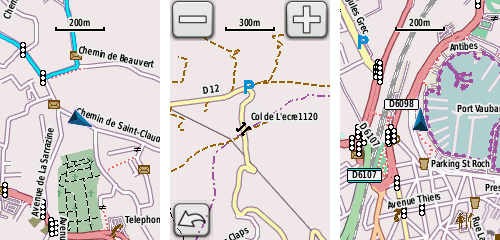

osm-garmin
==========

What is it ?
------------

Basically, it is a python script which generate small and pretty map for Garmin
GPS devices. Initially, it is optimised for Garmin EDGE 605/705.

History
-------

I have a Garmin Edge 605 and I am really fond of this product. But it is quite
an old product:

+ The screen is not as good and large as the new models' ones. So the contrast
  on the maps has to be high.
+ The navigation using the small joystick is not very fast. So when you try to
  use big maps, scrolling is slow and a full-redraw is often done.
+ The USB connectivity is slow so sending big maps (more than 1 GB) is a pain.
+ I tried several ready-to-use maps and generally the labels are too big so it
  hides the maps.

For all these reasons, I wanted to have a custom made map which I could
optimize for my device and for the way I use it:

+ I use it for biking. I then really don't need to display the buildings
  polygons which is in fact 66% of the size of a map. I just need to have the
  roads/tracks visible and the all the Points Of Interest (POI).
+ I want to see the mountain passes and elevation.

The maps will be based on the Open Street Map project (OSM). Moreover, as I
contribute to OSM, I also wanted to have an up-to-date map at least the day
after I commit some work: I don't want to wait for a monthly realease.

Screenshots
-----------

The following screenshots were taken from a Garmin Edge 800. The rendering is
also good on a Garmin Edge 605/705.

Dependencies
------------

The project depends upon:

+ Python 3.2
+ Java 7

Usage
-----

This is not a definitive usage guide:

    stac@debian:~/osm-garmin$ python3 map.py
